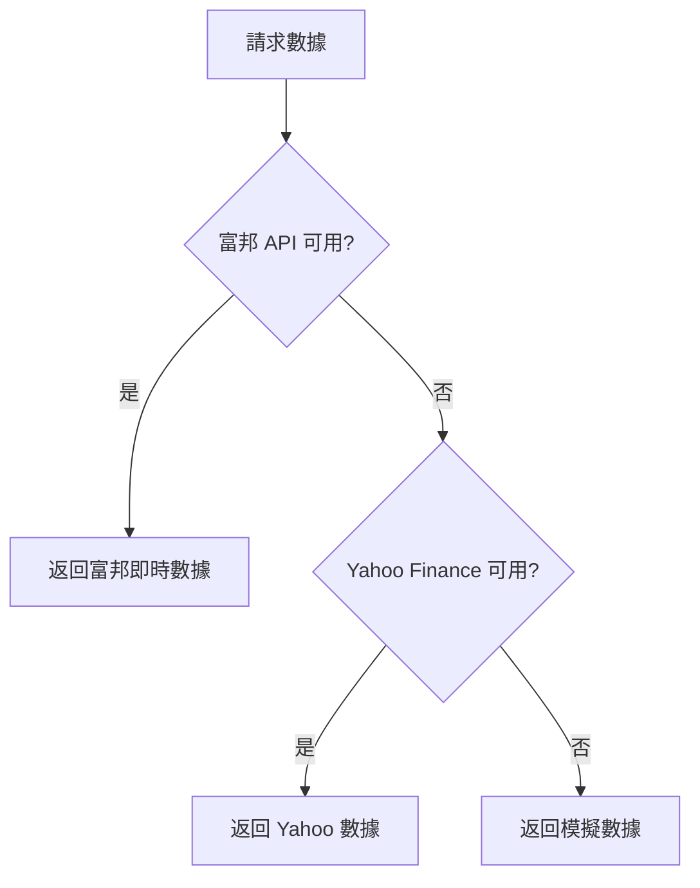

# 🚀 升級至 100% 真實數據指南

## 📊 當前數據狀態

| 數據類型 | 當前狀態 | 數據源 | 升級後 |
|---------|---------|--------|--------|
| 📈 報價數據 | ✅ 真實 | Yahoo Finance | ✅ 富邦 API (即時) |
| 📊 五檔報價 | ⚠️ 需連接 | 富邦 WebSocket | ✅ 富邦 API |
| 📋 成交明細 | ⚠️ 需連接 | 富邦 WebSocket | ✅ 富邦 API |

---

## 🔧 設定步驟

### 步驟 1：確認 `.env` 環境變數

編輯項目根目錄的 `.env` 檔案，確保以下變數已正確設定：

```bash
# 富邦 API 憑證 (加密後)
FUBON_USER_ID_ENCRYPTED=<您的加密帳號>
FUBON_PASSWORD_ENCRYPTED=<您的加密密碼>
FUBON_CERT_PATH=/Users/Mac/Documents/ETF/AI/Ａi-catch/N123715042.pfx
FUBON_CERT_PASSWORD_ENCRYPTED=<您的加密憑證密碼>

# 加密金鑰 (用於解密上述憑證)
ENCRYPTION_SECRET_KEY=<您的32字元加密金鑰>

# 開啟富邦 API
USE_FUBON_API=true
```

### 步驟 2：加密您的憑證（如果尚未加密）

如果您有原始帳號密碼，可以使用以下 Python 腳本加密：

```python
# encrypt_credentials.py
from cryptography.hazmat.primitives.kdf.pbkdf2 import PBKDF2HMAC
from cryptography.hazmat.primitives import hashes
from cryptography.hazmat.backends import default_backend
from cryptography.hazmat.primitives.ciphers.aead import AESGCM
import base64
import os

def encrypt_data(plaintext: str, secret_key: str) -> str:
    """加密數據"""
    salt = os.urandom(64)
    iv = os.urandom(16)
    
    kdf = PBKDF2HMAC(
        algorithm=hashes.SHA512(),
        length=32,
        salt=salt,
        iterations=100000,
        backend=default_backend()
    )
    key = kdf.derive(secret_key.encode())
    
    aesgcm = AESGCM(key)
    encrypted = aesgcm.encrypt(iv, plaintext.encode('utf-8'), None)
    
    # 分離密文和認證標籤
    ciphertext = encrypted[:-16]
    tag = encrypted[-16:]
    
    # 組合：salt + iv + tag + ciphertext
    result = salt + iv + tag + ciphertext
    return base64.b64encode(result).decode('utf-8')

# 使用範例
SECRET_KEY = "your-32-character-secret-key!!"  # 32 字元

user_id_encrypted = encrypt_data("您的身分證號", SECRET_KEY)
password_encrypted = encrypt_data("您的密碼", SECRET_KEY)
cert_password_encrypted = encrypt_data("您的憑證密碼", SECRET_KEY)

print(f"FUBON_USER_ID_ENCRYPTED={user_id_encrypted}")
print(f"FUBON_PASSWORD_ENCRYPTED={password_encrypted}")
print(f"FUBON_CERT_PASSWORD_ENCRYPTED={cert_password_encrypted}")
print(f"ENCRYPTION_SECRET_KEY={SECRET_KEY}")
```

### 步驟 3：確認憑證檔案

確保 `.pfx` 憑證檔案存在於指定路徑：
```bash
ls -la /Users/Mac/Documents/ETF/AI/Ａi-catch/N123715042.pfx
```

### 步驟 4：重啟後端服務

```bash
cd /Users/Mac/Documents/ETF/AI/Ａi-catch
./stop_v3.sh
./start_v3.sh
```

---

## 🧪 測試 API 連接

### 檢查富邦連接狀態
```bash
curl -s "http://localhost:8000/api/fubon/status" | jq
```

### 手動連接富邦 API
```bash
curl -X POST "http://localhost:8000/api/fubon/connect" | jq
```

### 測試即時報價
```bash
curl -s "http://localhost:8000/api/fubon/quote/2330" | jq
```

### 測試五檔掛單
```bash
curl -s "http://localhost:8000/api/fubon/orderbook/2330" | jq
```

### 測試成交明細 (新功能！)
```bash
curl -s "http://localhost:8000/api/fubon/trades/2330?count=20" | jq
```

---

## 📡 API 端點一覽

### 富邦證券 API

| 端點 | 方法 | 說明 | 數據源 |
|------|------|------|--------|
| `/api/fubon/status` | GET | 連接狀態 | - |
| `/api/fubon/connect` | POST | 手動連接 | - |
| `/api/fubon/quote/{symbol}` | GET | 即時報價 | 富邦 → Yahoo |
| `/api/fubon/quotes?symbols=2330,2454` | GET | 批量報價 | 富邦 → Yahoo |
| `/api/fubon/orderbook/{symbol}` | GET | 五檔掛單 | 富邦 WebSocket |
| `/api/fubon/trades/{symbol}?count=50` | GET | 成交明細 | 富邦 WebSocket |
| `/api/fubon/candles/{symbol}?days=60` | GET | K線數據 | 富邦 → Yahoo |

### 即時數據 API

| 端點 | 方法 | 說明 | 數據源 |
|------|------|------|--------|
| `/api/realtime/quote/{symbol}` | GET | 即時報價 | 富邦 → 模擬 |
| `/api/realtime/orderbook/{symbol}` | GET | 即時五檔 | 富邦 → 模擬 |

---

## 🔌 WebSocket 即時串流

### 連接 WebSocket
```javascript
const ws = new WebSocket('ws://localhost:8000/ws/stock/2330');

ws.onmessage = (event) => {
  const data = JSON.parse(event.data);
  console.log('即時數據:', data);
};
```

---

## ⚠️ 注意事項

1. **交易時段限制**
   - 富邦 API 的即時數據只在交易時段 (09:00-13:30) 可用
   - 盤後時段會回退到 Yahoo Finance 或模擬數據

2. **API 頻率限制**
   - 避免過於頻繁的請求（建議間隔 0.5 秒以上）
   - 批量請求時使用 `quotes` 端點

3. **憑證有效期**
   - `.pfx` 憑證需要定期更新（通常一年一次）
   - 更新後需修改 `FUBON_CERT_PATH` 和重新加密密碼

4. **SSL 憑證問題**
   - 系統已自動跳過富邦的 SSL 憑證驗證
   - 設定 `FUBON_SSL_SKIP=0` 可啟用嚴格驗證

---

## 📊 數據回退機制



---

## 🆘 常見問題排解

### Q: 五檔掛單顯示「模擬數據」
**A:** 檢查以下項目：
1. 是否在交易時段？
2. 富邦連接是否成功？(`/api/fubon/status`)
3. WebSocket 是否能正常連線？

### Q: 成交明細沒有數據
**A:** 可能原因：
1. 非交易時段
2. 該股票當日無成交
3. WebSocket 連線超時

### Q: 連接一直失敗
**A:** 檢查：
1. `.env` 中的憑證是否正確
2. 加密金鑰是否匹配
3. `.pfx` 憑證是否過期

---

## 📝 更新日誌

- **2026-01-11**: 新增 `/api/fubon/trades/{symbol}` 成交明細 API
- **2025-12-30**: 修復 WebSocket SSL 憑證問題
- **2025-12-25**: 整合富邦五檔掛單 API
